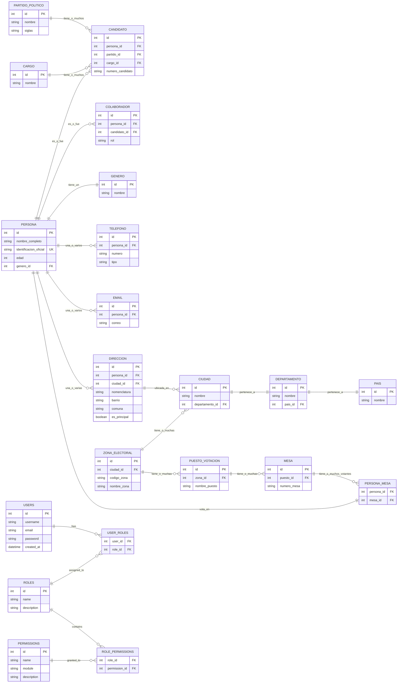

# Documentación del Modelo de Datos

Este diagrama representa la estructura de usuarios, permisos y la logística electoral.

```mermaid
erDiagram

    direction LR
    
    %% =========================
    %% Relaciones candidato
    %% =========================

    PARTIDO_POLITICO ||--o{ CANDIDATO : tiene_o_muchos
    CARGO ||--o{ CANDIDATO : tiene_o_muchos
    PERSONA ||--o{ CANDIDATO : es_o_fue
    PERSONA ||--o{ COLABORADOR : es_o_fue

    %% =========================
    %% Tablas Candidato
    %% =========================

    PARTIDO_POLITICO {
        int id PK
        string nombre
        string siglas
    }

    CANDIDATO {
        int id PK
        int persona_id FK
        int partido_id FK
        int cargo_id FK
        string numero_candidato
    }

    CARGO {
        int id PK
        string nombre
    }

    %% =========================
    %% Relaciones persona
    %% =========================

    PERSONA ||--|| GENERO : tiene_un
    PERSONA ||--o{ TELEFONO : una_o_varios
    PERSONA ||--o{ EMAIL : una_o_varios
    PERSONA ||--o{ DIRECCION : una_o_varias
    PERSONA ||--|| PERSONA_MESA : vota_en 


    PERSONA {
        int id PK
        string nombre_completo
        string identificacion_oficial UK
        int edad
        int genero_id FK
    }

    GENERO {
        int id PK
        string nombre
    }


    TELEFONO {
        int id PK
        int persona_id FK
        string numero
        string tipo
    }

    EMAIL {
        int id PK
        int persona_id FK
        string correo
    }

    DIRECCION {
        int id PK
        int persona_id FK
        int ciudad_id FK
        string nomenclatura
        string barrio
        string comuna
        boolean es_principal
    }

    %% =========================
    %% Relaciones geográficas   
    %% =========================

    DIRECCION ||--o{ CIUDAD : ubicada_en
    CIUDAD ||--|| DEPARTAMENTO : pertenece_a
    DEPARTAMENTO ||--|| PAIS : pertenece_a

    %% =========================
    %% Relaciones puesto de votación
    %% =========================
    ZONA_ELECTORAL ||--o{ CIUDAD : tiene_o_muchas
    ZONA_ELECTORAL ||--o{ PUESTO_VOTACION : tiene_o_muchas
    PUESTO_VOTACION ||--o{ MESA : tiene_o_muchas
    MESA ||--o{ PERSONA_MESA : tiene_o_muchos_votantes

    %% =========================
    %% Tablas puesto de votación
    %% =========================

     ZONA_ELECTORAL {
        int id PK
        int ciudad_id FK
        string codigo_zona
        string nombre_zona
    }

    PUESTO_VOTACION {
        int id PK
        int zona_id FK
        string nombre_puesto
    }

    MESA {
        int id PK
        int puesto_id FK
        string numero_mesa
    }


    %% =========================
    %% Tablas geográficas
    %% =========================

     CIUDAD {
        int id PK
        string nombre
        int departamento_id FK
    }

    DEPARTAMENTO {
        int id PK
        string nombre
        int pais_id FK
    }

    PAIS {
        int id PK
        string nombre
    }

  

 %% =========================   

    COLABORADOR {
        int id PK
        int persona_id FK
        int candidato_id FK
        string rol
    }

    PERSONA_MESA {
        int persona_id FK
        int mesa_id FK
    }

    %% =========================
    %% Relacion tablas Seguridad
    %% =========================
    USERS ||--o{ USER_ROLES : has
    ROLES ||--o{ USER_ROLES : assigned_to
    ROLES ||--o{ ROLE_PERMISSIONS : contains
    PERMISSIONS ||--o{ ROLE_PERMISSIONS : granted_to

    %% =========================
    %% Tablas Seguridad
    %% =========================

    USER_ROLES {
        int user_id FK
        int role_id FK
    }

    ROLE_PERMISSIONS {
        int role_id FK
        int permission_id FK
    }

    USERS {
        int id PK
        string username
        string email
        string password
        datetime created_at
    }

    ROLES {
        int id PK
        string name
        string description
    }

    PERMISSIONS {
        int id PK
        string name
        string module
        string description
    }
```